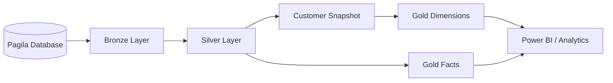
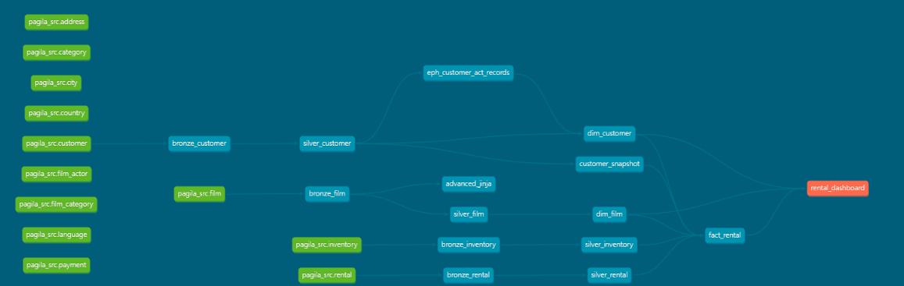
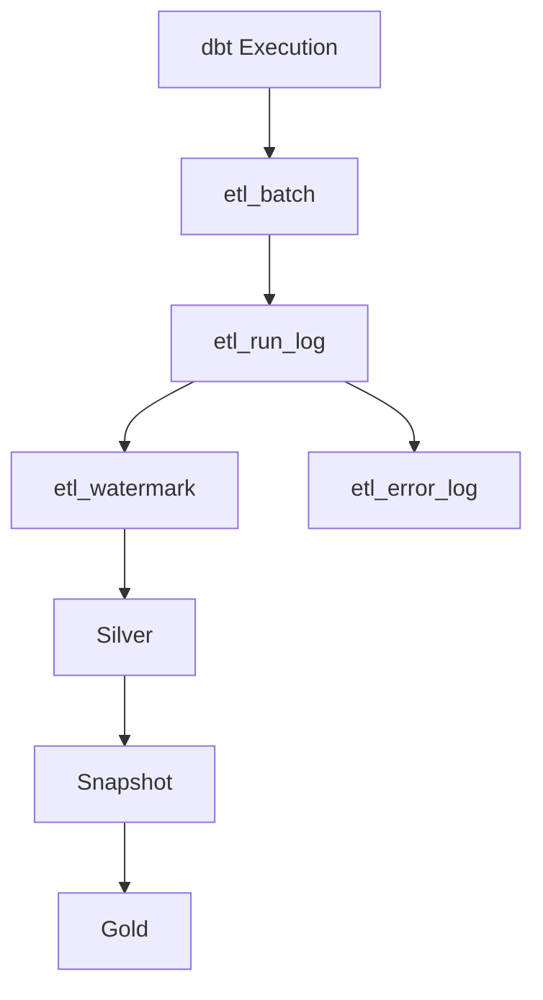
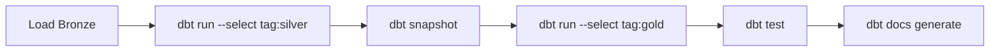

# 🚀 Pagila dbt Analytics Pipeline

<div align="center">

# Production-Grade Analytics Engineering with dbt

**Author:** **Muhammad Owais Ajaz**  
*Principal Data Engineer | Business Intelligence Engineer*

[]()
[]()
[]()
[]()
[]()

</div>

---

## 🌟 Overview

This project demonstrates how to build a **production-style Analytics Engineering platform** using **dbt Core** and **PostgreSQL**.

Rather than focusing only on data transformations, the project implements enterprise capabilities including:

- ✅ Medallion Architecture
- ✅ Incremental Processing
- ✅ Snapshot-based SCD Type 2
- ✅ Watermark Framework
- ✅ Audit Framework
- ✅ Generic Tests
- ✅ Data Contracts
- ✅ Documentation & Lineage

---

# 🏗 Overall Architecture





---

# ⚙️ Operational Framework



---

# 🧱 Medallion Architecture

| Layer | Purpose |
|-------|---------|
| 🥉 Bronze | Raw source aligned tables |
| 🥈 Silver | Cleansed, validated and deduplicated models |
| 🪙 Gold | Facts & Dimensions for Analytics |

---

# ✨ Key Features

## Data Engineering

- Medallion Architecture
- Incremental Models
- Merge Strategy
- Watermark Processing
- Deduplication
- SCD Type 2 Snapshots

## Audit Framework

- ETL Batch Tracking
- Model Run Logging
- Error Logging
- Execution Status
- Rows Processed
- Watermark Tracking

## dbt Features

- Sources
- Refs
- Macros
- Hooks
- Generic Tests
- Data Contracts
- Snapshots
- Documentation
- Lineage Graph

---

# 📁 Project Structure

```text
pagila_dbt_analytics
│
├── models
│   ├── bronze
│   ├── silver
│   └── gold
│       ├── dimensions
│       └── facts
│
├── snapshots
├── macros
├── tests
│   └── generic
├── analyses
├── seeds
└── dbt_project.yml
```

---

# 🔄 Pipeline Execution



## Run Flow

Use the following command to execute the full data pipeline in order:

```bash
dbt run --select bronze silver snapshot gold
```

---

# 📊 Data Quality

### Built-in Tests

- not_null
- unique
- relationships
- accepted_values

### Custom Generic Tests

- not_future_date
- positive_amount

---

# 📈 Audit Tables

| Table | Purpose |
|------|----------|
| audit.etl_batch | Batch execution tracking |
| audit.etl_run_log | Model execution history |
| audit.etl_error_log | Error logging |
| audit.etl_watermark | Incremental processing control |

---

# 💻 Technology Stack

- dbt Core
- PostgreSQL
- Python
- SQL
- Jinja
- Git

---

# 🚀 Getting Started

```bash
dbt deps

dbt run-operation deploy_framework

dbt run --select tag:silver

dbt snapshot

dbt run --select tag:gold

dbt test

dbt docs generate

dbt docs serve
```

---

# 🎯 Enterprise Capabilities

- Production-ready project structure
- Reusable Macros
- Generic Test Library
- Operational Audit Framework
- Snapshot History
- Incremental Processing
- Data Contracts
- Model Lineage
- Extensible Architecture

---

# 🔮 Roadmap

- dbt Packages
- Exposures
- Metrics
- Semantic Layer
- CI/CD (GitHub Actions / Azure DevOps)
- Observability Dashboard

---

# 👨‍💻 About the Author

**Muhammad Owais Ajaz**

Principal Data Engineer | Business Intelligence Engineer

This repository was built as a production-inspired reference implementation showcasing modern Analytics Engineering practices using dbt Core and PostgreSQL.
