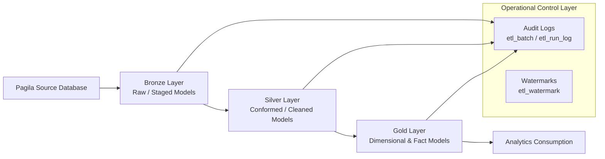

# Pagila dbt Analytics Pipeline

A polished dbt-based analytics pipeline for the Pagila sample database, designed to showcase a modern medallion-style architecture with strong observability, auditability, and extensibility.

This project demonstrates how to build a production-minded data warehouse workflow using PostgreSQL, dbt, and layered transformation models spanning bronze, silver, and gold stages.

## Overview

The pipeline ingests and transforms Pagila source data into analytics-ready models with a clear separation of concerns:

- Bronze layer: raw, source-aligned snapshots with load timestamps
- Silver layer: cleaned and conformed business entities
- Gold layer: dimensional and fact-based analytics tables
- Audit layer: operational logging and watermark tracking for run monitoring and incremental-style control

## Architecture



### Medallion design with dual implementation patterns

This project follows a medallion architecture while also showing two practical implementation styles:

- Transient implementation: lightweight staging and intermediate processing that supports rapid transformation and debugging
- Permanent implementation: durable curated tables in bronze, silver, and gold layers for reliable downstream consumption

The pipeline is also log-driven, meaning each run is captured through audit tables so the system is observable, inspectable, and production-friendly.

## What is implemented

### 1. Layered data modeling

The project is organized into three transformation layers:

- Bronze models: customer, film, inventory, rental, and actor data loaded into structured staging tables
- Silver models: curated business-ready models for downstream consumption
- Gold models: dimensional and fact tables for analytics use cases

### 2. Custom audit and control framework

To make the pipeline more operationally reliable, the project includes custom audit tables and hooks for tracking each run:

- audit.etl_batch: stores metadata for each dbt invocation
- audit.etl_run_log: tracks every model execution with start time, finish time, status, and row counts
- audit.etl_watermark: stores per-model watermark values to support incremental-style processing patterns

These are activated through the dbt hooks in the project configuration so that audit logging happens automatically during each run.

### 3. dbt project configuration

The project is configured to:

- materialize models in the appropriate layers
- apply pre/post hooks for runtime logging
- organize models into clear schemas for bronze, silver, and gold outputs

## Project structure

```text
pagila_dbt_analytics/
├── macros/
│   └── audit_sql/
│       ├── create_etl_batch.sql
│       ├── create_etl_run_log.sql
│       ├── create_etl_watermark.sql
│       ├── log_model_start.sql
│       ├── log_model_end.sql
│       └── deploy_framework.sql
├── models/
│   ├── bronze/
│   ├── silver/
│   └── gold/
│       ├── dimension/
│       └── fact/
├── analyses/
├── tests/
└── dbt_project.yml
```

## Complete setup guide for a new dbt user

Follow these steps to get this project running on your machine.

### 1. Prerequisites

Make sure you have the following installed:

- Python 3.9+
- PostgreSQL
- dbt Core
- A PostgreSQL client or tool such as pgAdmin or psql

### 2. Create a virtual environment

```bash
python -m venv venv
source venv/bin/activate
```

On Windows PowerShell:

```powershell
python -m venv venv
.\venv\Scripts\Activate.ps1
```

### 3. Install dbt

```bash
pip install dbt-postgres
```

If you are using a different adapter, install the matching one accordingly.

### 4. Create the PostgreSQL database

Create a PostgreSQL database for the project and make sure you have:

- a database name
- a username
- a password
- a host and port

### 5. Load the Pagila sample data

The project expects the Pagila sample database to be available as a source.

You can import the SQL files from the Pagila folder included in this repository.

### 6. Configure your dbt profile

Create or update your dbt profile file so that dbt can connect to PostgreSQL.

Typical location:

- Linux/macOS: ~/.dbt/profiles.yml
- Windows: %USERPROFILE%\.dbt\profiles.yml

Example:

```yaml
pagila_dbt_analytics:
  target: dev
  outputs:
    dev:
      type: postgres
      host: localhost
      user: postgres
      pass: your_password
      port: 5432
      dbname: pagila_db
      schema: public
      threads: 1
      keepalives_idle: 0
```

### 7. Install project dependencies

From the project directory:

```bash
cd pagila_dbt_analytics
dbt deps
```

### 8. Deploy the audit framework

Before running the models, create the audit tables:

```bash
dbt run-operation deploy_framework
```

This initializes the operational tables used by the pipeline.

### 9. Run the pipeline

```bash
dbt run
dbt test
```

### 10. Generate documentation

```bash
dbt docs generate
dbt docs serve
```

## Audit framework deployment

The audit tables are created using a dedicated dbt run operation:

```bash
dbt run-operation deploy_framework
```

This command initializes the operational foundation for the pipeline by creating:

- audit.etl_batch for run tracking
- audit.etl_run_log for model-level execution history
- audit.etl_watermark for incremental-style control points

These tables give the pipeline real operational visibility and make it suitable for production-style monitoring and troubleshooting.

## Run commands

```bash
dbt deps
dbt run
dbt test
dbt docs generate
dbt docs serve
```

## Why this project is valuable

This implementation is more than a sample project. It reflects a production-ready mindset by combining:

- layered analytics modeling with bronze, silver, and gold stages
- reusable dbt macros for maintainability
- built-in auditability for troubleshooting and observability
- operational control tables for run tracking and watermark management
- a clean, GitHub-friendly structure for collaboration and extension

## Production-ready characteristics

This pipeline is designed to be practical for real-world analytics engineering work because it supports:

- repeatable execution with dbt orchestration
- transparent monitoring through audit logs
- controlled data processing patterns using watermark tracking
- scalable extension to additional business domains and data sources

## Notes

The project is intentionally structured to be easy to extend. You can add more source tables, additional gold models, data quality tests, or more advanced incremental logic as the pipeline grows.

## Credits

Built as a dbt analytics workflow using the Pagila sample database and a custom audit framework for transparency, monitoring, and production-style pipeline readiness.
